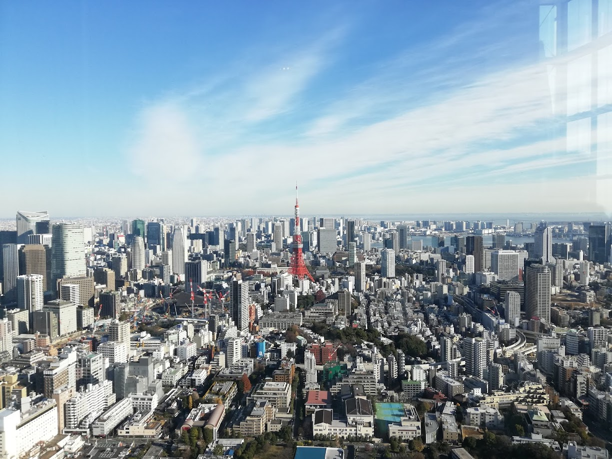
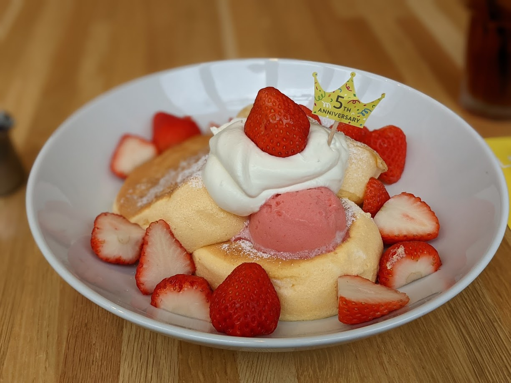
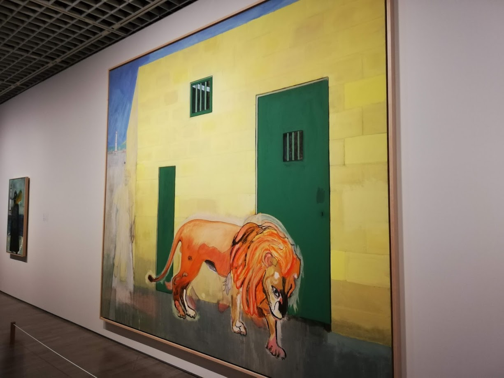

Hi. Thank you for visiting my Web site.

This is my self-introduction.

## Table of contents

1. About me
2. My favorite things
3. My interests
4. What I'm doing now
5. What I want to do in the future

## 1. About me

I was born in Ibaraki Prefecture and spent time in high school.

The top image is the local countryside.

I moved to Chiba prefecture when I entered university, and after graduating from university, I live in Tokyo.

  

I majored in global environmental science at university.

I became interested in IT when I learned that IT is useful for solving global environmental problems.

The first programming language I learned was C, which I learned in a university class.

After that, I studied Ruby, and in my graduation research, I created an environmental household account book application as a web application with Ruby on Rails, and studied the effect of that application on environmentally conscious behavior.

After graduating from university, I joined a system integration company, but I wanted to become a DevOps engineer for a service provider in the future, so I changed jobs at the beginning of the second year.

Currently, I am mainly working on service maintenance and development at a Real Estate Tech company.

I spend my holidays growing grass on Github, watching anime on Netflix, and watching music videos on Youtube.

Or I go out to eat some delicious pancakes I found online.

  

## 2. My Favorite things

I like sweets. I especially love dough-based sweets like crepes.

I like black tea, especially flavored teas like Earl Gray. It's great to have it with sweets.

I like art so I sometimes go to museums.

  

My favorite languages ​​are JavaScript, TypeScript, Ruby and Golang.

My favorite editor is VS Code.

## 3. My interests

### Technology

I am interested in blockchain technology.

I'm also interested in technologies such as Microservices, gRPC, and WebAssembly.

### Business area

I am interested in businesses that can be directly or indirectly involved in solving climate change issues.

For example, energy domain, carbon offset, carbon neutral, etc ...

I believe that the use of blockchain technology is effective for these.

## 4. What I'm doing now

I am working hard every day to improve my skills in web application development.

I would like to acquire a wide range of skills such as front end, back end, and infrastructure area.

## 5. What I want to do in the future

I want to be an engineer who can contribute to the growth of the business area of ​​interest by using the technology that I am interested in.

And I want to be influenced by various people, influence various people, grow as an engineer and a business person, and have an impact on society.
